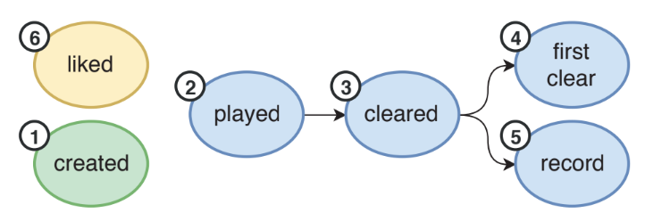
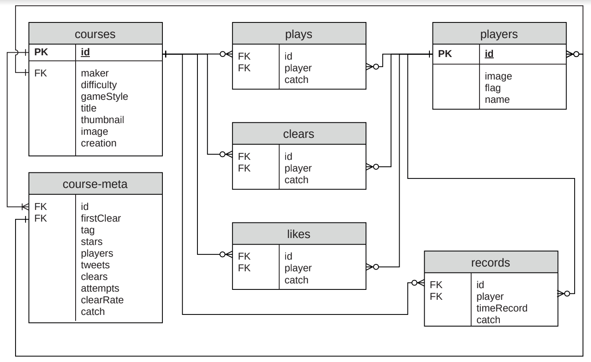

# Lab06 - Artigo de Dataset Público

# Aluno
* 256352: Cristiano Sampaio Pinheiro

# Análise do Artigo SMMnet: A Social Network of Games Dataset

| campo | valor |
|------------|----------------------------------------|
| referência | Moraes, L. M. P., & Cordeiro, R. L. F. (2019). SMMnet: A Social Network of Games Dataset. Dataset Showcase Workshop, SBBD 2019. https://sites.google.com/view/sbbd-dsw/artigos?authuser=0 |
| link       | https://drive.google.com/file/d/1JbYl_OQzHH-GiZmDYXmARnwA0Yg4TJYh/view|
| dataset | https://www.kaggle.com/leomauro/smmnet |
| formato | CSV |

## Resumo

Com o avanço tecnológico, os jogos, e todo o ecosistema que os rodeiam, evoluiram de tal maneira que as interações entre jogador-jogo se multiplicaram e diversificaram, sendo estudadas por uma área própria. A Modelagem de Jogadores é uma área responsável pelo estudo das interações que representam as experiências dos jogadores, partindo desse área de estudo o artigo estudado relata a criação do primeiro dataset para Modelagem de Jogadores proveniente de uma rede de interações jogadores-jogo do Super Mario Maker, o SMMnet. 

Esse dataset é composto por dados de mais de 115 mil níveis do Super Maria Maker, totalizando dados de mais de 880 mil jogadores. Ainda, aproximadamente 7 milhões de interações de diferentes tipos foram registradas. Nesse dataset  foram mapeadas 6 tipos de interações, que se resumem a: criar um novo nível, jogar um nível criado por outro jogador, ao completar um nível o jogador "cleared", limpou, aquele nível, um jogador também pode ser o primeiro a limpar um nível ou quebrar o recorde de tempo de um determinado nível, por fim, é possivel dar like a um determinado nível. Essas interações podem ser visualizadas na Figura 1.  

 
_Figura 1: Diagrama das interações no Super Mario Maker_

Os dados descritos foram retirados do site [SMM Bookmark](https://supermariomakerbookmark.nintendo.net/) usando um web crawler. Devido ao volume de dados e limitações na extração, esse dataset engloba somente dados de 4 países,  sendo eles: França(FR), Alemanha(DE), Canadá(CA) e Brasil(BR). Tais dados estão armazenados em formato CSV nos arquivos: COURSES.CSV, COURSE-META.CSV, PLAYERS.CSV, PLAYS.CSV, CLEARS.CSV, LIKES.CSV e RECORDS.CSV. O esquema dessas 7 tabelas que compõem esse banco de dados relacional pode ser visualizado na Figura 2.

_Figura 2: Esquema do SMMnet_

Desse conjunto de dados também são apresentadas algumas estatísticas, como a proporção de estilos de jogo e dificuldades registrados. A distribuição de níveis por nacionalidade e também os tipos de interações no top 100 níveis com maior número de interaçõeo, entre outras. 

## Perguntas de pesquisa/análises

O SMMnet pode ser  usado para várias aplicações como:  
* Rede de interações  
  Segundo os autores é possível formar pelo menos 3 tipos de grafos usando o dataset. Um grafo estático que permite observar uma "foto" da rede de interações. Uma rede de interações com curtidas e um grafo dinâmico, acompanhando a mudança das redes. Em todos os casos é necessário levar em conta as multiplas relações e/ou complexidade entre os objetos. Essa abordagem pode levar a estudos de detecção de comunidade, predição de likes, ranqueamento, entre outros.

* Inteligência Artificial em Jogos  
  Os dados presente nesse dataset podem ser utilizados para Data Mining, com apredizado supervisionado ou não, e modelagem dos jogadores, extraindo característica das atividades dos jogadores na rede de interação.

* Detecção de Jogadores Influentes  
  O dataset já foi usado para detectar como jogadores influentes criam novas tendências publicando conteúdo online. Esse estudo também tem inpactos no mercado, sendo que empresas investem em influenciadores visando difundir seus produtos.

* Dificuldade x Likes  
  Aqui apresento uma ideia de minha autoria. A muito se fala como a indústria vem tornado os jogos mais fáceis visando aumentar o consumo e garantir a satisfação dos jogadores. Os dados provenientes do dataset apresentado podem ser ultilizados para verificar o quão o público está engajado de acordo com a dificuldade imposta pelos games.

## Trabalhos relacionados

Os autores ressaltam que há muitos datasets publicados com foco na indústria geral e em jogos idependentes, no entato, nenhum deles apresenta informações relacionadas a rede de interações nos jogos, o que dificulta estudos sociais nesse contexto.

No proprio artigo é citado que SMMnet é o primeiro dataset para Modelagem de Jogadores proveniente de uma rede de interações jogadores-jogo. Dessa forma, não há trabalhos diretamente relacionados, mas vale citar a fonte dos dados que possibilitaram a criação desse dataset: [SMM Bookmark](https://supermariomakerbookmark.nintendo.net/).
