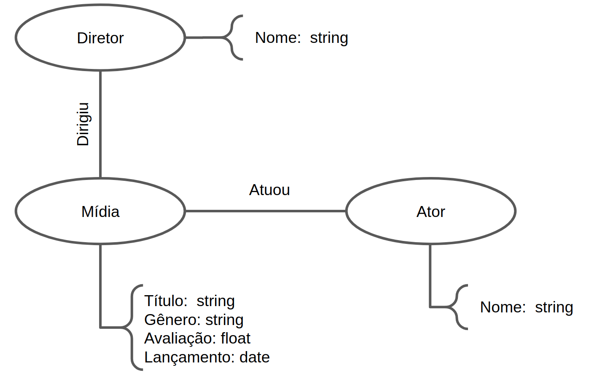

# Lab07 - Modelo Lógico para Banco de Dados de Grafos

# Aluno
* 256352: Cristiano Sampaio Pinheiro

## Modelo Lógico do Banco de Dados de Grafos

## Perguntas de Pesquisa/análise

* Com o grafo montado teremos uma resposta visual de quais atores e diretores são mais populares na indústria cinematográfica. Ainda, é possível responder se obras com melhor avaliação são as que reunem os indivíduos mais populares. Por fim, é possível quantificar quantas obras separam atores/diretores populares de pessoas que exercem esse mesmo papel com menos notoriedade. 
* Olhando agora para o gênero das mídias, com o grafo montado é possível estimar quantos atores/diretores separam duas obras de gêneros totalmentes diferentes, como terror e comédia. Ainda, podemos mapear atores/diretores com maior flexibilidade, trabalhando em obras de diversos gêneros.
* Com esses dados também podemos validar se há uma tendência de certas pessoas trabalharem juntas. Ou ainda, qual o intervalo de tempo médio, com base na data de lançamento das obras, em que determinadas pessoas trabalham juntas.